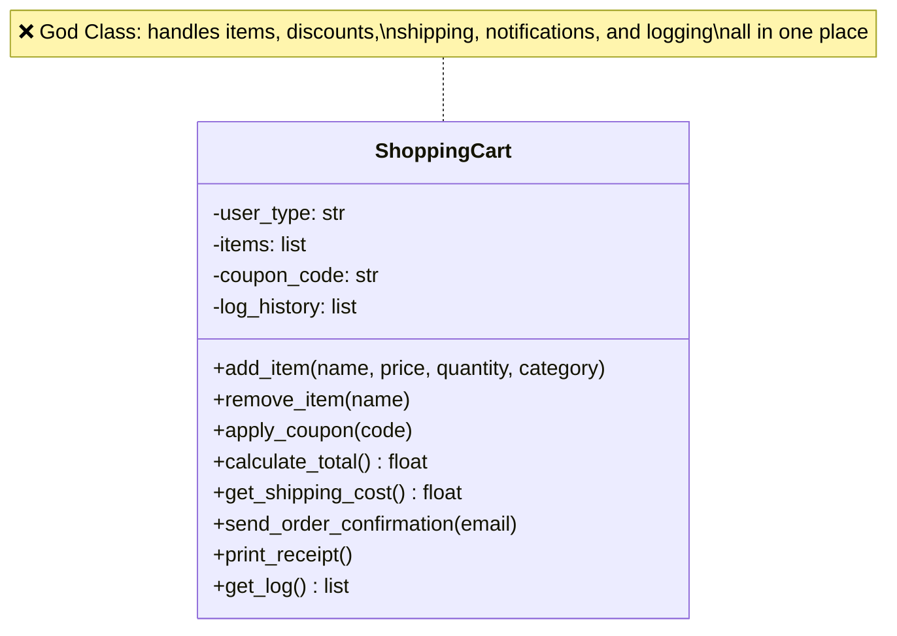
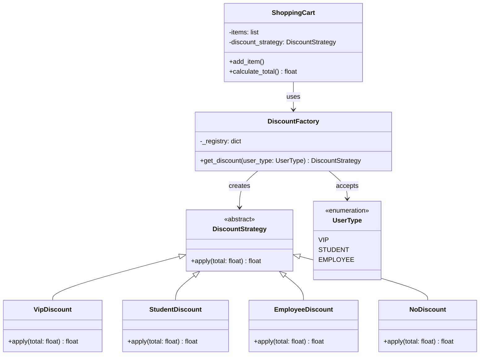
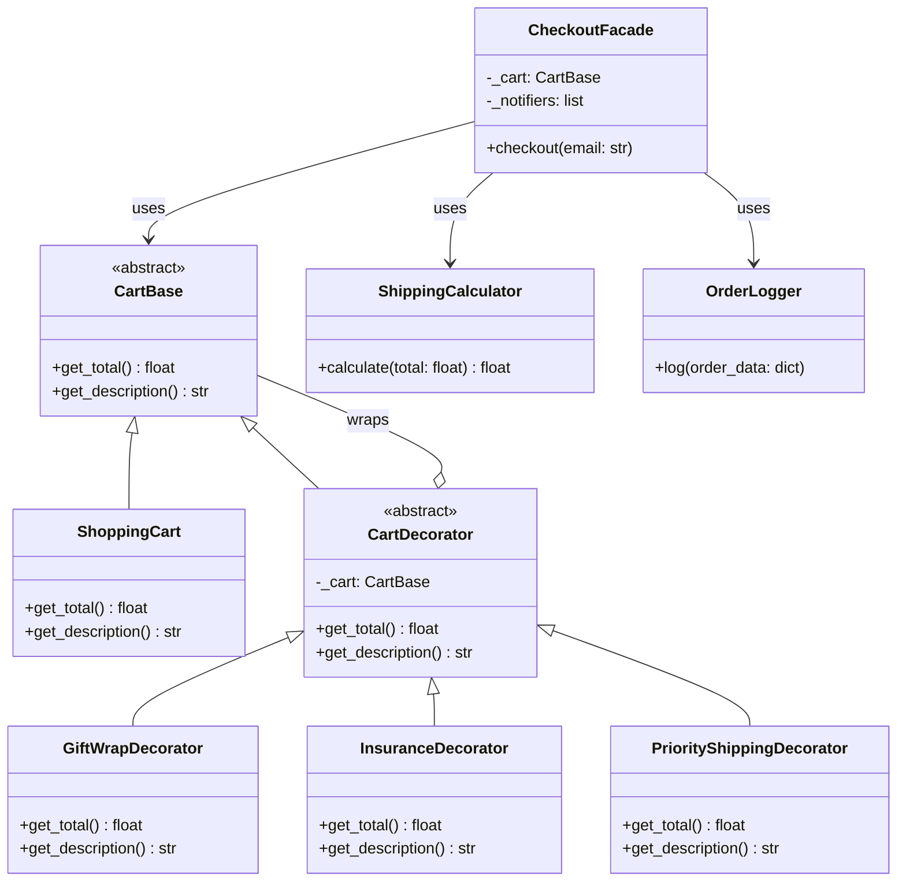
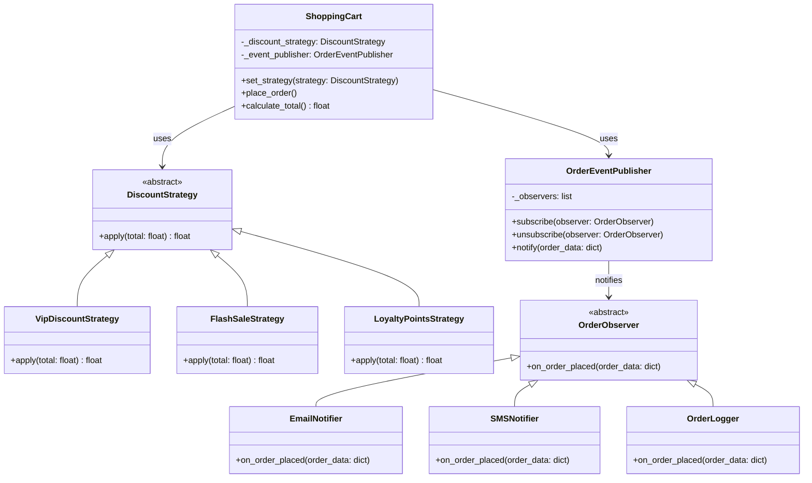

# 🏗️ Evolving System — E-Commerce Cart

**Topic Choice: D — E-Commerce Shopping Cart**

I chose this topic because shopping cart logic is one of the most common structures in real-world web projects. Features like discount rules, notifications, and checkout flows make it easy to see concretely why design patterns are necessary. It also directly aligns with my interests in web development and software engineering.

---

## What Is This Project?

This project documents the process of refactoring an intentionally poorly written e-commerce cart system using design patterns across three phases. Each phase applies one or more patterns to solve a real, identified problem in the codebase.

---

## Design Patterns Used

| Phase | Pattern | Category | Where Applied |
|-------|---------|----------|---------------|
| Phase 1 | Factory Method | Creational | Creating discount objects |
| Phase 2 | Decorator | Structural | Layering cart features (gift wrap, insurance, etc.) |
| Phase 2 | Facade | Structural | Unifying the checkout flow into a single interface |
| Phase 3 | Strategy | Behavioral | Making discount rules interchangeable |
| Phase 3 | Observer | Behavioral | Managing order confirmation notifications |

---

## Architecture Diagram

### Phase 0 — Before (Bad Code)



---

### Phase 1 — Factory Method (Creational)



---

### Phase 2 — Decorator + Facade (Structural)



---

### Phase 3 — Strategy + Observer (Behavioral)



---

## How to Run

Requires Python 3.

```bash
# Clone the repository
git clone https://github.com/Noluthando-2018/tasarim-oruntuleri.git
cd tasarim-oruntuleri

# Run the project
python -m src/main.py
```

---

## Branch Structure

```
main      → clean, final merged state
phase-1   → Creational pattern work
phase-2   → Structural pattern work (branched from phase-1)
phase-3   → Behavioral pattern work (branched from phase-2)
```

---

## Project Structure

```
tasarim-oruntuleri/
├── README.md
├── PROBLEMS.md
├── PATTERNS.md
├── src/
│   ├── shopping_cart.py
│   └── main.py
└── docs/
    ├── diagrams/
    └── ai-log/
        ├── phase1.md
        ├── phase2.md
        └── phase3.md
```
